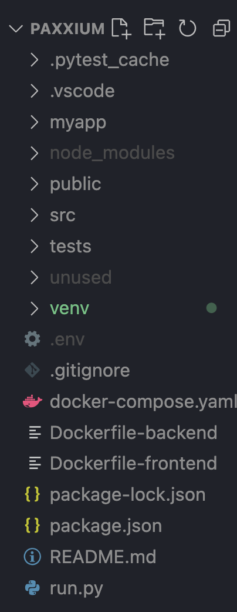

# Paxxium

To spin this up you will need two .env files
Backend - 
  location:
  
  
  contents:
  OPENAI_API_KEY
  SERPAPI_API_KEY
  ACTIVELOOP_TOKEN

  You will also need to set up a firebase project with authentication and Firestore database. *I will willing to share this upon request.
  The location of where to put that file can be seen in the above photo.

Frontend -
  location:
  

  contents:
  firebase config settings. Again, this I am willing to share upon request.

Starting the app is done by running python run.py and npm start from the root.

Sign up for an account and be redirected.

Clicing new chat will give the user three AI Agents to chose from. GPT 3.5, GPT-4 or AgentDebate. GPT 3.5 and 4 are clones of Chat-GPT(almost). AgentDebate allows the user to pick a topic and set the role for two different AI Agents.
